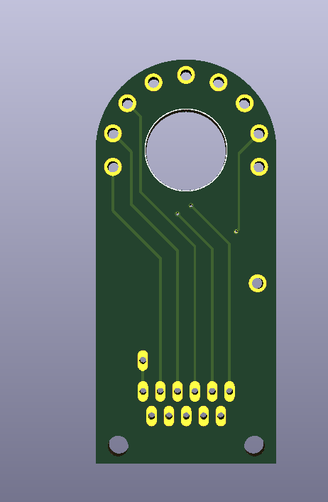
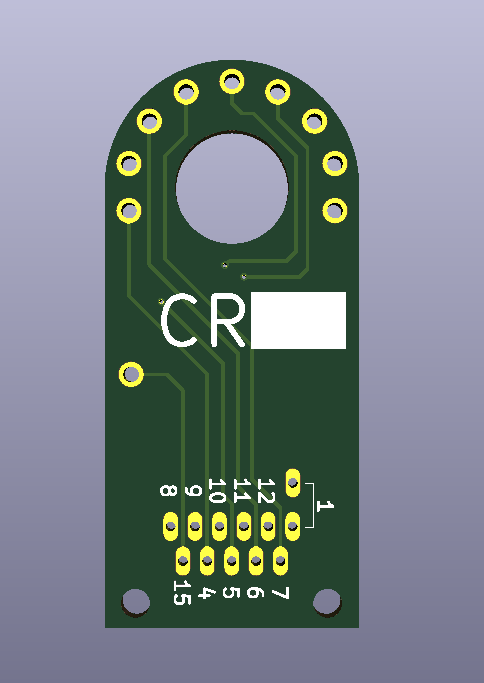
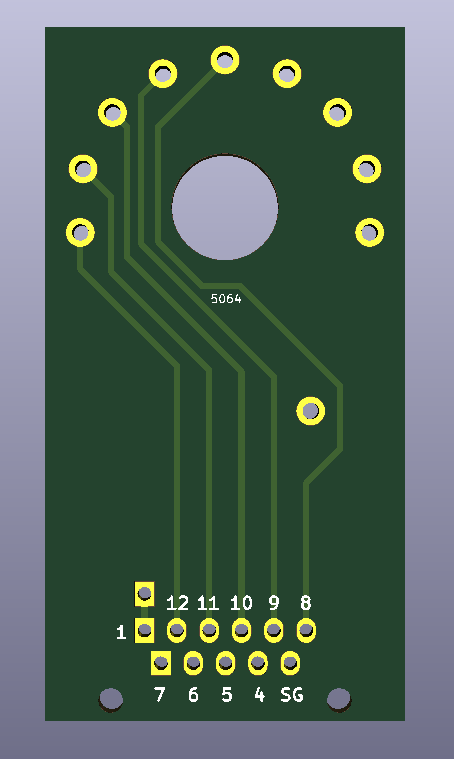
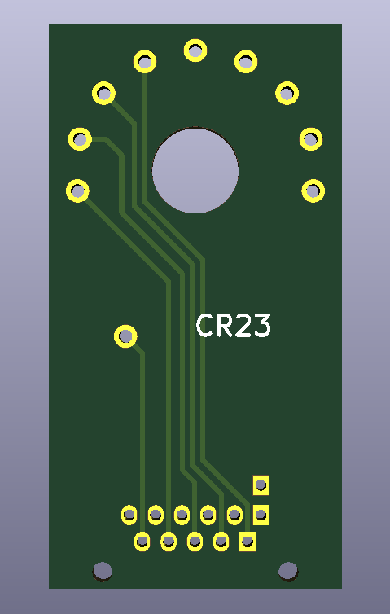
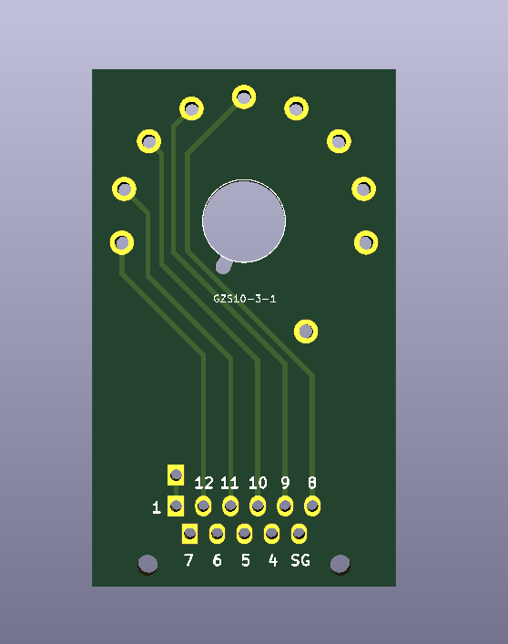
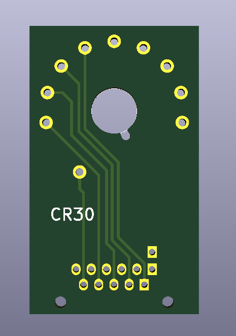
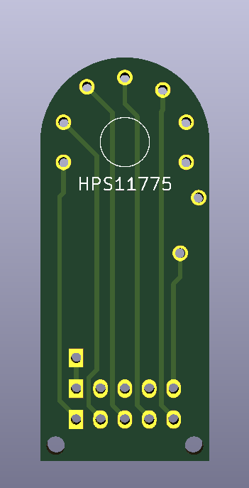
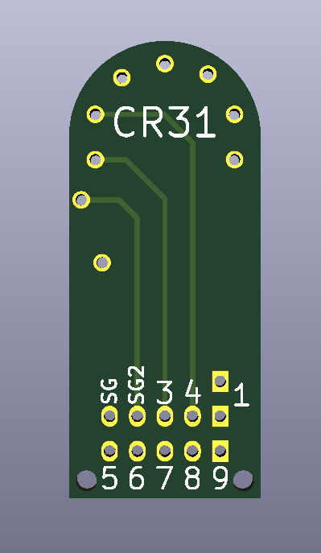

# CRT_Socket_Breakouts
These are just breakout boards for breakout out each pin on a CRT socket. The CR23 one is a little less than ideal, but it did work with my B&K 467 and this design should be fine until I do a redesign. These are NOT finished adapters, these are just breakout boards. Reference the B&K documentation for pinouts and wiring diagrams.

*Warning*: CRTs contain high voltage and can be hazardous to your health. These adapters are offered for free as is with no liability and you are making these at your own risk.

- CR23 (Larger footprint) is based off of Hosiden 5046 socket
- CR30 is based off of GZS10-3-1

## Boards Renders
### CR23
**Front**  
  
**Back**  
  

### CR23 Larger Footprint
**Front**  
  
**Back**  
  

### CR30
**Front**  
  
**Back**  

### CR31
**Front**  
  
**Back**  

